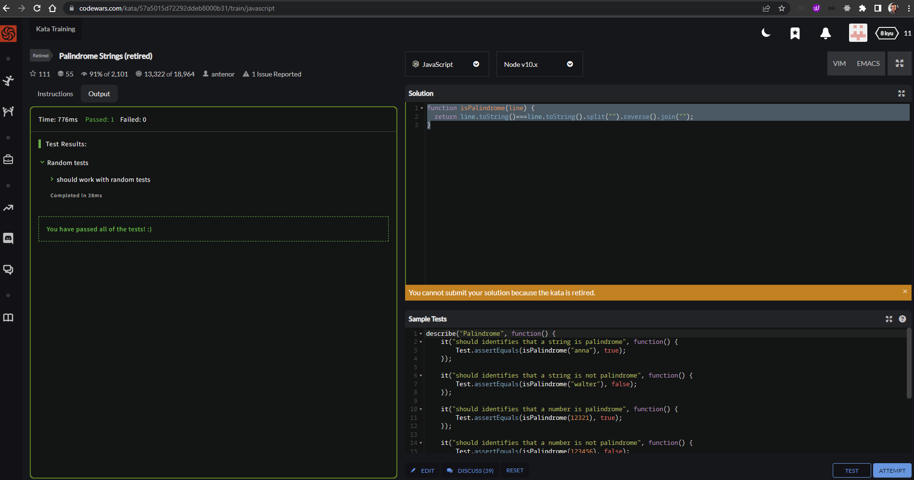

# core-code-upskilling-readme
> Carlos Rodrigo Estrada Najarro
>
> [CodeWars Profile: Completed solutions](https://www.codewars.com/users/carlos-estrada-telus/completed_solutions)
### Table of content

- [Week 1](#week-1)
    - [Challenge 1: Ensure Question](#challenge-1-ensure-question)
    - [Challenge 2: Reversed Words](#challenge-2-reversed-words)
    - [Challenge 3: Smallest Integer In Array](#challenge-3-smallest-integer-in-array)
    - [Challenge 4: Odd Or Even](#challenge-4-odd-or-even)
- [Week 2](#week-2)
    - [Challenge 1: Is Palindrome?](#challenge-1-is-palindrome)
    - [Challenge 2: Well Of Ideas](#challenge-2-well-of-ideas)
    - [Challenge 3: React Manage Events](#challenge-3-react-manage-events)
    - [Challenge 4: React Santa Wish List](#challenge-4-react-santa-wish-list)
- [Week 3](#week-3)
    - [Challenge 1: Is Palindrome?](#challenge-1-build-search-filter-in-react)
    - [Challenge 2: Fetch random user](#challenge-2-fetch-random-user-data)
    - [Challenge 3: React router blog](#challenge-3-react-router-blog)
    - [Challenge 4: Redux lecture](#challenge-4-redux-lecture)
- [Week 4](#week-4)
    - [Challenge 1: Two to one](#challenge-1-two-to-one)
    - [Challenge 2: Leap year](#challenge-2-leap-years)
    - [Challenge 3: Maximum length difference](#challenge-3-maximum-length-difference)
    - [Challenge 4: Base64 numeric translator](#challenge-4-base64-numeric-translator)
- [Week 5](#week-5)
    - [Challenge 1: Fun With Lists](#challenge-1-fun-with-lists)
    - [Challenge 2: Separating Strings](#challenge-2-separating-strings)
    - [Challenge 3: Highest Scoring Word](#challenge-3-highest-scoring-word)
    - [Challenge 4: Where Is My Parent?](#challenge-4-where-is-my-parent)


---
# Week 1

## Challenge 1 Ensure Question

Code:
``` Javascript
function ensureQuestion(s) {
  return s.slice(-1) === '?' ? s : s+'?';
}
```

## Challenge 2 Reversed Words

Code:
``` Javascript
function reverseWords(str){
  return str.split(" ").reverse().join(" "); 
}
```

## Challenge 3 Smallest Integer In Array

Code:
``` Javascript
class SmallestIntegerFinder {
  findSmallestInt(args) {
    return args.sort((a,b)=>a-b)[0]
  }
}
```
## Challenge 4 Odd Or Even

Code:
``` Javascript
function oddOrEven(array) {
   return !array.length||(array.reduce((prev,curr)=>prev+curr)%2===0)?'even':'odd';
}
```
# Week 2

## Challenge 1 Is Palindrome

Code:
``` Javascript
function isPalindrome(line) {
  return line.toString()===line.toString().split("").reverse().join("");
}
```
`Palindrome Taka was retired`

## Challenge 2 Well Of Ideas

Code:
``` Javascript
function well(x){
let numberGoodIdeas = x.filter(i=>i==='good').length;
  if(numberGoodIdeas<1){
    return 'Fail!';
  }else if(numberGoodIdeas<3){
    return 'Publish!';
  }
  return  'I smell a series!';
}
```
## Challenge 3 React Manage Events

Code:
``` Javascript
import React from 'react';

export class Counter extends React.Component {
  constructor(props) {
    super(props);
    this.state = {counter: 0}
  }
  
  // Your event handlers 
  render() {
    return (
      <div>
        <h1 id="counter">{this.state.counter}</h1>
          <button id="decrement" onClick={()=>this.setState(prevState =>({counter:prevState.counter-1}))} type="button">
            Decrement
          </button>
          <button id="increment" onClick={()=>this.setState(prevState =>({counter:prevState.counter+1}))} type="button">
            Increment
          </button>
      </div>
    )
  }
}
```
## Challenge 4 React Santa Wish List

Code:
``` Javascript
const React = require("react");

class WishlistForm extends React.Component {
  constructor(props) {
    super(props);
    this.state = {name:'',wish:'',priority:1}
    this.handleChange = this.handleChange.bind(this);
    this.handleChangeName = this.handleChangeName.bind(this);
    this.handleChangeWish = this.handleChangeWish.bind(this);
    this.handleSubmit = this.handleSubmit.bind(this);
  }
  
  handleChange(event) {
    this.setState({priority: event.target.value});
  }
  handleChangeName(event) {
    this.setState({name: event.target.value});
  }
  handleChangeWish(event) {
    this.setState({wish: event.target.value});
  }
  
   handleSubmit(event) {
    send(this.state);
     event.preventDefault();
  }
  
  render() {
    return (
      <form onSubmit={this.handleSubmit} >
        <label for="name">name:</label>
        <input value={this.state.name} onChange={this.handleChangeName} type="text" id="name" />
        <label for="wish">wish</label>
        <textarea id="wish" value={this.state.wish} onChange={this.handleChangeWish} />
        <label for="priority">Priority</label>
          <select id='priority' value={this.state.priority} onChange={this.handleChange}>
            <option value={1}>1</option>
            <option value={2}>2</option>
            <option value={3}>3</option>
            <option value={4}>4</option>
            <option value={5}>5</option>
          </select>
       <input type="submit" value="Submit" />
      </form>
    );
  }
};

```
# Week 3
> [Week 3 challenges](./challenges/src/challenges/Week3)
## Challenge 1 Build Search Filter In React

Code:
``` Javascript
import React, { useState } from "react";

const tempArray = [
  "Banana",
  "Apple",
  "Orange",
  "Mango",
  "Pineapple",
  "Watermelon",
];

export const Challenge1 = () => {
  const [search, setSearch] = useState(tempArray);

  const searchArray =(e)=>{
    if(!e.target.value) {setSearch(tempArray); return;}
    setSearch(tempArray.filter(t=>t.toLowerCase().includes(e.target.value.toLowerCase())));
  }

  return (
    <div style={{border: '2px solid black'}}>
          <h2>Challenge #1</h2>
      <input onChange={searchArray} />
      <ul>
      {
          search.map(e=>( <li key={e}>{e}</li> ))
      }
      </ul>
    </div>
  );
};
```
## Challenge 2 Fetch Random User Data 

Code:
``` Javascript
import React, { useState } from "react";
import { useEffect } from "react";

export const Challenge2 = () => {
  const [obj, setObj] = useState({
    id: 1,
    name: "Leanne Graham",
    username: "Bret",
    email: "Sincere@april.biz",
    address: {
      street: "Kulas Light",
      suite: "Apt. 556",
      city: "Gwenborough",
      zipcode: "92998-3874",
      geo: {
        lat: "-37.3159",
        lng: "81.1496",
      },
    },
    phone: "1-770-736-8031 x56442",
    website: "hildegard.org",
    company: {
      name: "Romaguera-Crona",
      catchPhrase: "Multi-layered client-server neural-net",
      bs: "harness real-time e-markets",
    },
  });

  useEffect(() => {
    updateUser();
  }, [])
  

  const updateUser = () => {
    fetch(
      `https://jsonplaceholder.typicode.com/users/${
        Math.floor(Math.random() * (10 - 1) + 1)
      }`
    )
      .then((response) => response.json())
      .then((json) => setObj(json));
  };

  return (
    <div style={{ border: "2px solid black" }}>
      <h2>Challenge #2</h2>
      <h3>User Data</h3>
      <button onClick={updateUser}>Reset</button>
      <p>
        <strong>Name:</strong>
        {obj.name}
      </p>
      <p>
        <strong>Website:</strong>
        {obj.website}
      </p>
      <p>
        <strong>Email:</strong>
        {obj.email}
      </p>
      <p>
        <strong>Phone:</strong>
        {obj.phone}
      </p>
    </div>
  );
};

```
## Challenge 3 React Router Blog 

Code:
``` Javascript
import {Route,Routes, Navigate, Link} from 'react-router-dom';


export const Challenge3 = () => {
 

  return (
    <div style={{border: '2px solid black'}}>
      <h2>Challenge #3</h2>

      <Routes>
        <Route path="/" element={(
          <>
          <ul>
            <li>
              <h3><Link to='/react' >React</Link> </h3>
            </li>
            <li>
              <h3><Link to='/corecode' >Core Code</Link> </h3>
            </li>
            <li>
              <h3><Link to='/helloworld' >Hello world</Link> </h3>
            </li>
          </ul>
            
          </>
        )} />
        <Route path="/react" element={(
          <>
            React
            <h4><Link to='/'>👈Back</Link> </h4>
          </>
        )} />
        <Route path="/corecode" element={(
          <>
            corecode
            <h4><Link to='/'>👈Back</Link> </h4>
          </>
        )} />
        <Route path="/helloworld" element={(
          <>
            helloworld
            <h4><Link to='/'>👈Back</Link> </h4>
          </>
        )} />
        <Route path="*" element={<Navigate to='/'/>} />
      </Routes>
    </div>
  );
};
```
## Challenge 4 Redux lecture
[Redux lecture Link](https://dev.to/thesanjeevsharma/just-redux-the-complete-guide-44d5)

# Week 4
> [Week 3 challenges](./challenges/src/challenges/Week3)
## Challenge 1 Two To One

Code:
``` Javascript
function longest(s1, s2) {
  return [...new Set((s1+s2).split(''))].sort().join('')
}
```
## Challenge 2 Leap Years

Code:
``` Javascript
function isLeapYear(year) {
  return year%100===0&&year%400!==0?false:year%400===0 || year%4===0?true:false
}
```

## Challenge 3 Maximum Length Difference

Code:
``` Javascript
function mxdiflg(a1, a2) {
  let maxDiff= -1;
  
  a1.forEach(x=>{
    a2.forEach(y=>{
      let x1=x.length;
      let y1= y.length;
      let temp=Math.abs(x1-y1)
      if(temp>maxDiff) maxDiff=temp;
    })
  })
  
  return maxDiff;
  
}
```
## Challenge 4 Base64 Numeric Translator

Code:
``` Javascript
function base64toBase10(base64) {
  const base = 'ABCDEFGHIJKLMNOPQRSTUVWXYZabcdefghijklmnopqrstuvwxyz0123456789+/';
  return base64.split('').reduce((p, c) => p * 64 + base.indexOf(c), 0);
}
```

# Week 5

## Challenge 1 Fun With Lists

Code:
``` Javascript
function map(head, f) {
  return !head?null: new Node(f(head.data),map(head.next,f));
}
```

## Challenge 2 Separating Strings

Code:
``` Javascript
function sepStr(str) {
  const words=str.split(' ');
  let maxSize= 0
  
  words.forEach(w=>{
    if(w.length>maxSize) maxSize=w.length;
  })
  
  let output=[]
  for(i=0;i<maxSize;i++){
    for(j=0;j<words.length;j++){
      if(output[i]){
        output[i].push(words[j][i]?words[j][i]:'')
        
      }else{
        output[i]=[words[0][i]?words[0][i]:'']
      }
    }
  }
  
  return output
}
```

## Challenge 3 Highest Scoring Word

Code:
``` Javascript
function high(x){
  return x.split(' ').map(w =>
    ({ word: w, value: w.split('').reduce((prev, current) => prev + current.charCodeAt() - 96, 0) }))
    .sort((a, b) => b.value - a.value)[0].word
}
```

## Challenge 4 Where Is My Parent?

Code:
``` Javascript
function findChildren(dancingBrigade) {
  return dancingBrigade.split('').sort().filter(p => p === p.toLocaleUpperCase()).map(p => {
    let output = p
    dancingBrigade.split('').forEach(c => {
      if (c === c.toLocaleLowerCase() && c.toLocaleUpperCase() === p) {
        output += c;
      }
    })
    return output;
  }).join('')
}
```